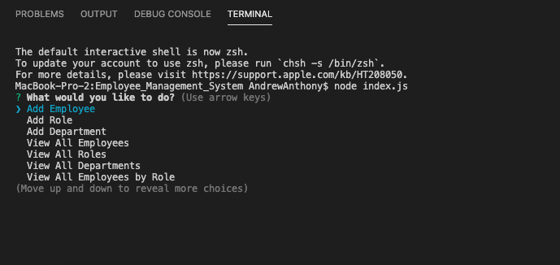
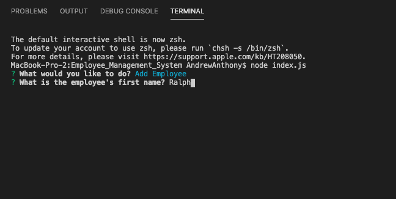
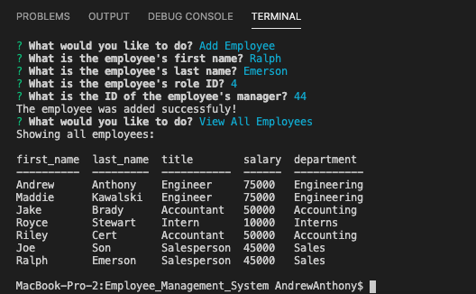

# Employee_Management_System

## What, Why, and HOW
With this assignment, I was motivated to push the boundaries of my skill with MySQL and the ways in which it interacts with JavaScript. We've used Inquirer so much at this point in the class that it almost comes second nature, but updating the MySQL database by taking in user input from inquirer added a whole new puzzle to be figured out. It was definitely very difficult at times. MySQL has it's own set of quirks that can be tricky for a beginner, and on top of that I had to figure out how to dynamically update the MySQL database I created for this assignment. Finally, on top of that I had to figure out how to join three tables together, which is something we hadn't done in class before. It was all very tricky, but I'm really happy with the end result.
To achieve this end result, I:
1. Created a database with three tables
2. Built a command-line application that prompts a user to add to, view, or update the information in those tables
3. Connected the user input from the command-line application to the database so that the database could be dynamically added to, viewed, and updated by the user.

The assignment wasn't extremely complex, but it was very tricky. There were a lot of spots where, even if the logic was straightforward, the syntax was new or hard to figure out. In the end, though, I think I accomplished just about everything I wanted to with this assignment, and I'm really happy with the results.

# Links
Link to GitHub repo: https://github.com/andrew1835/Employee_Management_System
 
Link to Screen capture: https://drive.google.com/file/d/1Sfz2xNXPGsowXfv5zPycSOx6waNdEkjK/view

# Screenshots
This first screenshot shows what the user is presented with after typing "node index.js" in the console:

 

This second screenshot shows the first question the user is prompted with when they choose "Add Employee". I've gone ahead and typed "Ralph" into the input field so that you can see that Ralph was added to the Employee list (shown in the final screenshot):

 

This final screenshot shows what happens when the user chooses to View Employees. As you can see, I've joined information from all three tables to show all relevant information about each employee. (note: these employees were added by me ahead of time into the database by utilizing this application. For anyone who downloads and utilizes this application, they will have to add their own employees for information to show up when clicking one of the "View" options):

 

